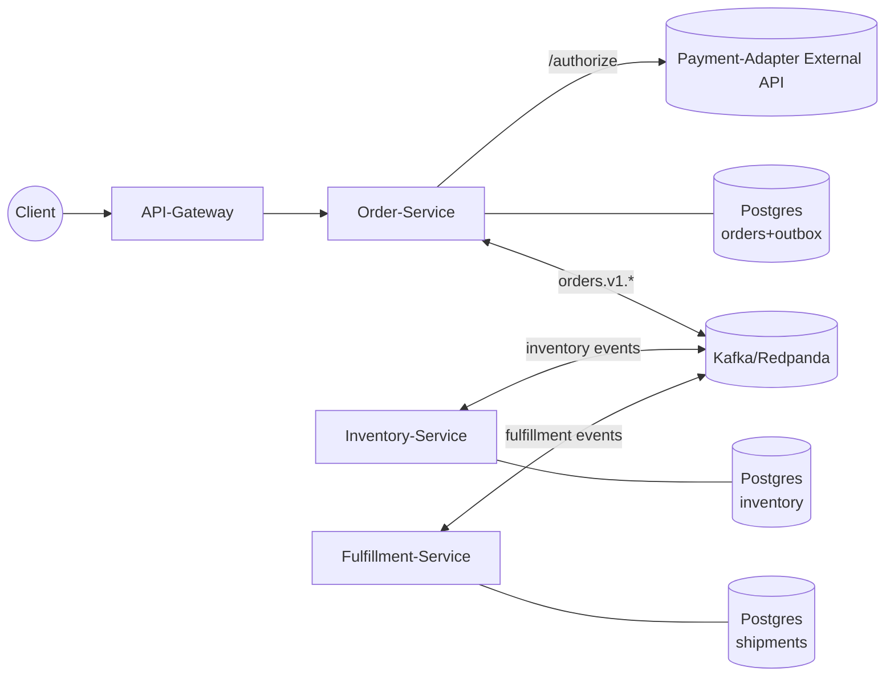
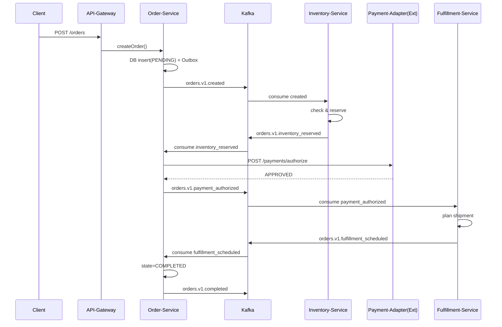

```mermaid

flowchart LR
  Client((Client))
  AGW[API-Gateway]
  ORD[Order-Service]
  INV[Inventory-Service]
  PAYEXT[(Payment-Adapter External API)]
  FUL[Fulfillment-Service]
  KAFKA[(Kafka/Redpanda)]
  PG1[(Postgres
  orders+outbox)]
  PG2[(Postgres
  inventory)]
  PG3[(Postgres
  shipments)]

  Client --> AGW --> ORD
  ORD --- PG1
  INV --- PG2
  FUL --- PG3

  ORD <-->|orders.v1.*| KAFKA
  INV <-->|inventory events| KAFKA
  FUL <-->|fulfillment events| KAFKA

  ORD -->|/authorize| PAYEXT

```

```mermaid

sequenceDiagram
  participant C as Client
  participant G as API-Gateway
  participant O as Order-Service
  participant K as Kafka
  participant I as Inventory-Service
  participant P as Payment-Adapter(Ext)
  participant F as Fulfillment-Service

  C->>G: POST /orders
  G->>O: createOrder()
  O->>O: DB insert(PENDING) + Outbox
  O->>K: orders.v1.created
  K->>I: consume created
  I->>I: check & reserve
  I->>K: orders.v1.inventory_reserved
  K->>O: consume inventory_reserved
  O->>P: POST /payments/authorize
  P-->>O: APPROVED
  O->>K: orders.v1.payment_authorized
  K->>F: consume payment_authorized
  F->>F: plan shipment
  F->>K: orders.v1.fulfillment_scheduled
  K->>O: consume fulfillment_scheduled
  O->>O: state=COMPLETED
  O->>K: orders.v1.completed

```