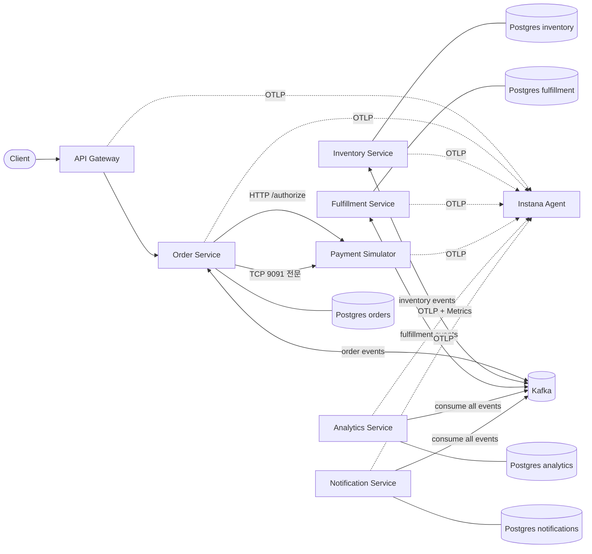
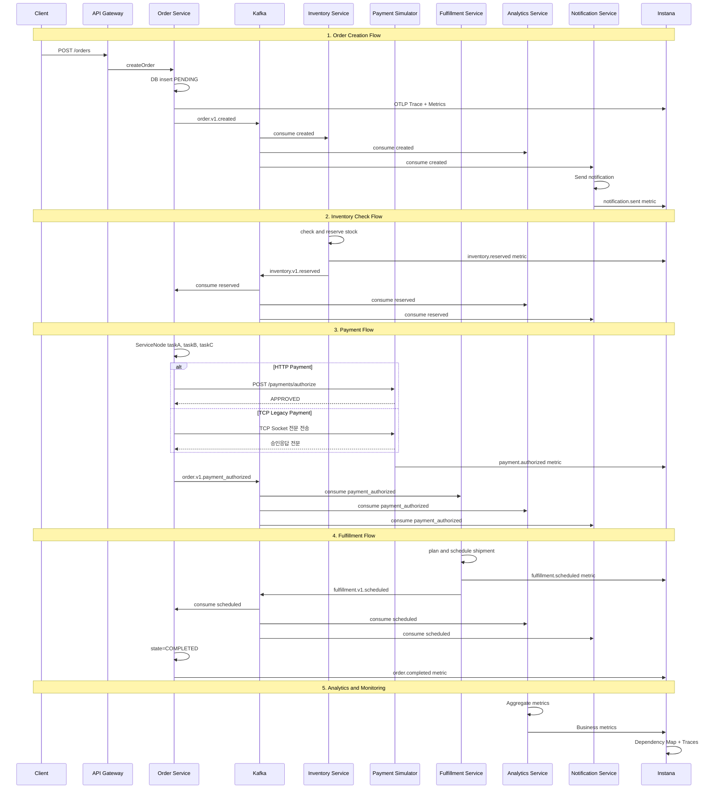

# Architecture

## System Architecture

## Event Flow Sequence

## Architecture Overview

### Services
- **API Gateway**: Entry point for all client requests
- **Order Service**: Manages order lifecycle and orchestration
- **Inventory Service**: Handles stock management and reservations
- **Payment Simulator**: Simulates external payment gateway (HTTP REST + TCP Socket)
- **Fulfillment Service**: Manages shipping and delivery
- **Analytics Service**: Collects and analyzes business metrics
- **Notification Service**: Sends notifications via email/SMS/push

### Infrastructure
- **Kafka**: Event streaming platform for async communication
- **PostgreSQL**: Database for each service with separate schemas
- **Instana**: APM and observability platform

### Communication Protocols
- **HTTP/REST**: API Gateway ↔ Services, Order ↔ Payment (modern)
- **Kafka Events**: Async event-driven communication between services
- **TCP Socket**: Order ↔ Payment (legacy protocol simulation)

### Key Features
1. **Event-Driven Architecture**: All services communicate via Kafka events
2. **Multi-Protocol Support**: HTTP/REST, Kafka, TCP Socket
3. **OpenTelemetry Integration**: Full distributed tracing and metrics
4. **Virtual Service Nodes**: Method-level tracing with @ServiceNode annotation
5. **Business Metrics**: Custom metrics for business KPIs
6. **Legacy Integration**: TCP socket-based legacy payment gateway simulation
7. **Multi-environment**: Docker Compose for local, Kubernetes for production